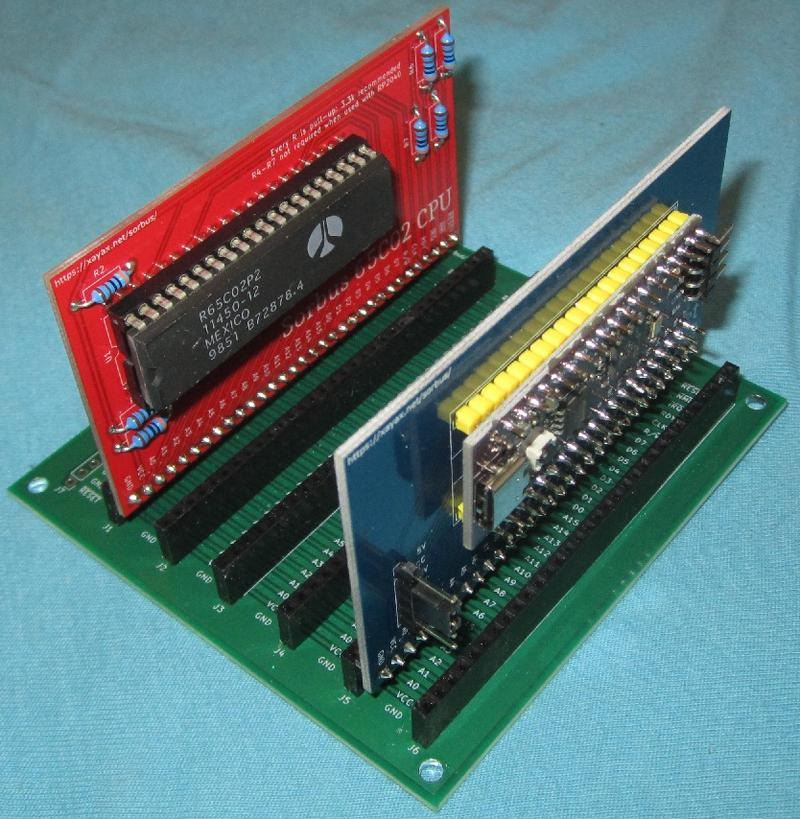
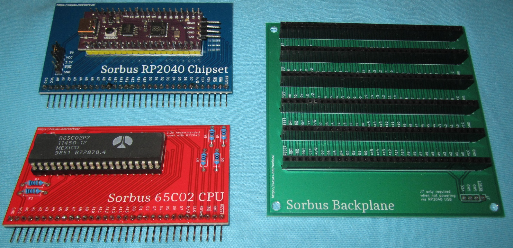
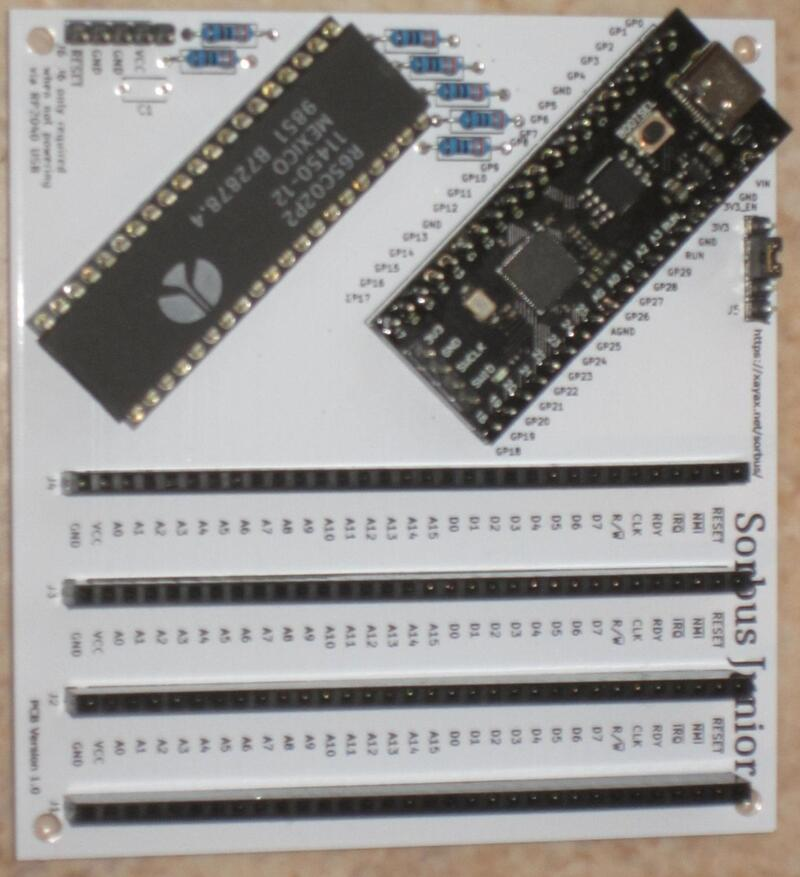

The Sorbus Computer
===================

The attempt to build a very simple 65C02 based computer by utilizing a
Raspberry Pi Pico clone for the rest of the functionality.

The Project is capabile to run as an [Apple Computer 1](doc/apple1.md)
as well as an own monitor command prompt (mcp) to learn about the 65C02
processor and it siblings.

The project is fully open source, licensend under GPL v3:
  - the PCB design is in the folder pcb
    - the Raspberry Pi Pico clone is found under the term "Purple PR2040"
      on AliExpress and other sites
    - the clone is used because all GPIOs of the RP2040 are required
  - the 65C02 source code to run on the target is at src/65c02
    - compiling requires the [cc65](https://cc65.github.io/), which
      needs to be preinstalled.
  - the source code for the Raspberry Pi Pico clone is at src/rp2040
    - compiling requires the
      [Pico-SDK](https://github.com/raspberrypi/pico-sdk) from the
      Raspberry Pi Foundation, which will be downloaded if not previously
      configured. However it's dependencies must also be preinstalled.
  - for generating the CP/M-65 filesystem
    [cpmtools](https://github.com/lipro-cpm4l/cpmtools) is also required

[An addtional page](https://xayax.net/sorbus/) has been setup to explain more
about the ideas of the system, as well as some usecases.

Also there is now an
[independent review](http://retro.hansotten.nl/the-sorbus-computer/)
available at the wonderful
[Retro Computing pages](http://retro.hansotten.nl/) of Hans Otten.

To access the RP2040 without super user rights, make sure that your user is
in the groups "plugdev" and "dialout". You also need to add a udev rule. This
is available as part of picotool in the `udev` folder.

Build Targets
-------------

The toplevel `Makefile` is added as a convenience layer to build things more
easily. It wraps the call of `cmake` and `make` to configure the Raspberry Pi
Pico project, as well as some other useful things. The following make targets
are available:

  - make all
    - checks for availablilty of the Pico SDK and downloads it, if required
    - creates a new build directory
    - wraps the call to `cmake` and `make` to build the project
  - make log
    - almost same as "all"
    - more verbose compilation, e.g. compiler calls with parameters
    - creates a file `make.log`
  - make clean
    - runs a `make clean` on build directory
  - make distclean
    - removes build directory entirely to force restart from scratch
  - make setup-apt
    - installs packages on Debian required to build the project
    - used by git actions to prepare building of a release
  - make setup-dev
    - runs "setup-apt", as well as doing modifications to make sure
      that terminal and picotool work
  - make picotool
    - checks out and builds picotool
  - make setup-external
    - sets up tools required to build external code, like
      - [CP/M 65](https://github.com/davidgiven/cpm65) (requires
        [llvm-mos-sdk](https://github.com/llvm-mos/llvm-mos-sdk))
      - [TaliForth2](https://github.com/SamCoVT/TaliForth2)
        (requires [64tass](https://tass64.sourceforge.net/))
  - make release
    - used by git action to build a release

There are also some build scripts available for special cases:

  - src/tools/upload.sh
    - script used to build and transfer software using picotool
      (needs rewrite)
    - defaults to uploading the native core
  - src/tools/external-taliforth2.sh
    - script to checkout, build and install the TaliForth2
      binary ready for building the filesystem image
    - only required for native core
  - src/tools/external-cpm65.sh
    - script to checkout, build and install the files required
      to include CP/M 65 into the filesystem image
    - only required for native core

It is also possible to build C programs using cc65 for this computer. This
is rather a proof of concept that a full featured implementation, but it
does work rather stable. More details are in it's own
[README](src/65c02/cc65/README.md).
