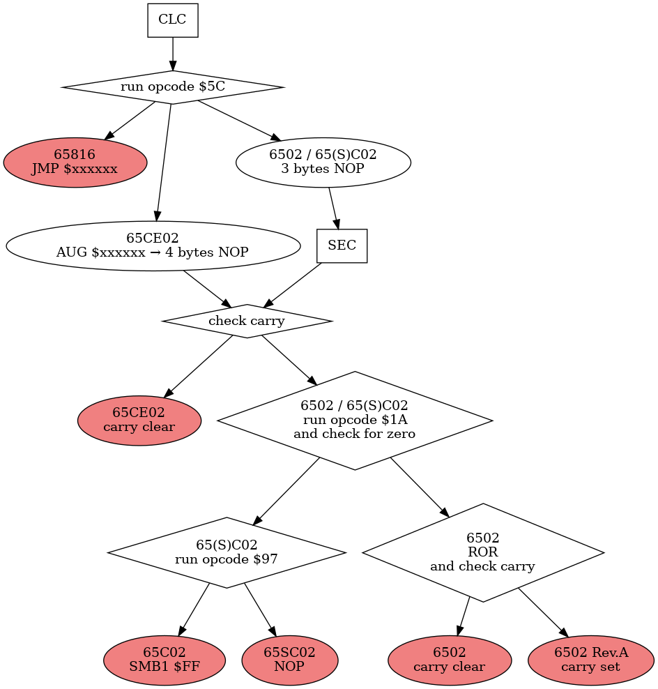

CPU Detection Routine
=====================

The Sorbus Computer can run any kind of 6502 Variant. The small test and
learn environment "Monitor Command Prompt" or MCP for shot (pun very
intended) can be used to learn all the details about each CPU up to a
certain degree. (Not all pins are connected due to a limit amount of
GPIO pins of the RP2040.)

However, it is interesting to know which CPU it is running on. Since the
"Native" Core is the one with the most features, but does not work with
an (old) NMOS 6502, it should be a good idea to detect that CPU and print
an error message.

A very easy way to tell apart an NMOS 6502 CPU and all the following CMOS
variants is quite easy. In 65C02 assembly is looks something like this

```
; 65C02        ; NMOS 6502
   LDA   #$00  ; LDA   #$00
   DEC         ; .byte $3a  ; "illegal" NOP
   BNE   CMOS  ; BNE   CMOS
```

In the above case `DEC` will be assembled to $3A which is an undocumented
(also called "illegal") `NOP` opcode. So, while the `LDA #$00` sets the
zero-flag, it will be cleared by the `DEC` opcode, but not by the "illegal"
`NOP` opcode. This is a short and efficiant way to tell NMOS and CMOS
variants apart. (Note this works with the `INC` ($1A) Opcode as well.)

```
; 65816        ; 65C02           ; 6502
   LDA   #$01  ; LDA   #$01      ; LDA   #$01
   XBA         ; .byte $eb ; NOP ; .byte $EB, $EA ; "illegal" SBC #$EA
   NOP         ; NOP             ; 
   LDA   #$EA  ; LDA   #$EA      ; LDA   #$EA
   XBA         ; .byte $eb ; NOP ; .byte $EB, $EA ; "illegal" SBC #$EA
   NOP         ; NOP             ; 
;  A=$01       ; A=$EA           ; A=$00
```

But there is another point where a CPU detection is very handy. If you
search for cheap 65C02 processors, you typically get an offering on ebay
or AliExpress for WDC W65C02S processors. However none of those are
original ones, but all of those are pull of machines, and then get
relabeled. (At least the ones I've seen so far.) For this project it
would not be that bad, if they would not throw in NMOS 6502s in the mix
as well, which don't fit the requirements.

It would be useful, if one could tell CPUs apart by their instruction
sets. There are five different instruction sets have been seen in chips
with a pin layout similar to the original NMOS 6502 and the CMOS 65C02:

- NMOS 6502
- 65C02, the base CMOS variant, as compared to the NMOS version,
  a couple of bugs were fixed, and new instructions were introduced
- 65SC02, a 65C02 with the bit-related opcodes removed ($x7 and $xF are
  just 1 byte, 1 cycle NOPs)
- 65816, a 16 bit capable variant of the 65SC02, with all 256 opcodes
  defined now
- 65CE02, a CMOS reimplementation of the 65C02 by Commodore with also
  256 opcodes defined

The pin layout is not 100% the same on all chips, but still enough to
run all CPUs with the Sorbus Computer, while omitting some of their
features provided by pins on the chip.

The "runtime environment" is - as all other runtime environments like
the previous mentioned MCP and Native Cores - written in C. It provides
everything up to the RAM and clock signal. The running core to detect
the CPU should write an identifier to the last byte of memory. If this
value changes from the default one, the processing will be stopped.

Since the code will be rather simple, the environment provided also
should be rather simple. Except from the "return value" no I/O is
required. Memory used can also be kept very low: 32 bytes have been
proven to be enough, if the memory is "wrapped around" by not fully
decoding the address. The code size is just 24 bytes, by the amount of
memory provided needs to be a power of 2.

The "result-byte" written to the end of memory will then be evaluated.
If it is in the defined range, the processor type id will be returned
by the runtime environment, otherwise a zero to indicate a failure.

The basic idea for supplying the return code is a slide of `INX`
opcodes, which then writes the result to the exit code address ($FF).
So the code would pratically something like this:
```
   LDX   #$00 ; clear out X
   ; run test code
   ; [...]
   ; other return codes
:is65816      ; exit for 16 bit 65816
   INX
:is65C02      ; exit for CMOS 65C02
   INX
:is6502       ; exit for NMOS 6502
   INX
   STX   $FF  ; stops runtime environment
```
This way, if a specific CPU was detected, jumping to the matching
label will then return the proper code. So, for example a jump to
`is65816` returns a `3`, while `is6502` returns a `1`.

Because reading the [sourcecode](../src/65c02/cpudetect.s) is very
hard, let's use a simple flow chart on how the detection is
implemented. Red bubbles are a successful detection of a CPU variant.




Test as seen by the CPUs
========================

Hexdump
-------
```
0000: 18 5c 0f 00 38 90 07 8a 1a f0 06 97 ff e8 e8 e8  .\..8...........
0010: e8 e8 86 ff ea ea ea ea ea ea ea 4c 1e 00 a2 00  ...........L....
```
This is the initial memory configuration when starting the detection
environment.

Note that the reset vector points to the interrupt vector. The interrupt
vector contains code and then wraps around to $0000 (running as $0020).
Two bytes of free memory gained, since 7 bytes (the $EA/NOP bytes) are
spares. The $4C is just a precaution to prevent the reset vector from
being executed as opcodes.

Disassembly as seen on a 6502
-----------------------------
```
 17:001e r a2    :LDX  #$00
 18:001f r 00    :
 19:0020 r 18    :CLC
 20:0021 r 5c    :
 21:0021 r 5c    :NOP. $000F,X
 22:0022 r 0f    :
 23:0023 r 00    :
 24:000f r e8    :
 25:0024 r 38    :SEC
 26:0025 r 90    :
 27:0025 r 90    :BCC  $002E
 28:0026 r 07    :
 29:0027 r 8a    :TXA
 30:0028 r 1a    :
 31:0028 r 1a    :NOP.
 32:0029 r f0    :
 33:0029 r f0    :BEQ  $0031
 34:002a r 06    :
 35:002b r 97    :
 36:0031 r e8    :INX
 37:0032 r 86    :
 38:0032 r 86    :STX  $FF
 39:0033 r ff    :
 40:00ff w 01    :
```

Disassembly as seen on a 65C02
------------------------------
```
 16:001e r a2    :LDX  #$00
 17:001f r 00    :
 18:0020 r 18    :CLC
 19:0021 r 5c    :
 20:0021 r 5c    :NOP. #$000F
 21:0022 r 0f    :
 22:0023 r 00    :
 23:ff0f r e8    :
 24:ffff r 00    :
 25:ffff r 00    :
 26:ffff r 00    :
 27:ffff r 00    :
 28:0024 r 38    :SEC
 29:0025 r 90    :
 30:0025 r 90    :BCC  $002E
 31:0026 r 07    :
 32:0027 r 8a    :TXA
 33:0028 r 1a    :
 34:0028 r 1a    :INC
 35:0029 r f0    :
 36:0029 r f0    :BEQ  $0031
 37:002a r 06    :
 38:002b r 97    :SMB1 $FF
 39:002c r ff    :
 40:00ff r 00    :
 41:00ff r 00    :
 42:00ff w 02    :
```

Disassembly as seen on a 65SC02
-------------------------------
```
 16:001e r a2    :LDX  #$00
 17:001f r 00    :
 18:0020 r 18    :CLC  
 19:0021 r 5c    :
 20:0021 r 5c    :NOP. #$000F
 21:0022 r 0f    :
 22:0023 r 00    :
 23:ff0f r e8    :
 24:ffff r 00    :
 25:ffff r 00    :
 26:ffff r 00    :
 27:ffff r 00    :
 28:0024 r 38    :SEC  
 29:0025 r 90    :
 30:0025 r 90    :BCC  $002E
 31:0026 r 07    :
 32:0027 r 8a    :TXA  
 33:0028 r 1a    :
 34:0028 r 1a    :INC  
 35:0029 r f0    :
 36:0029 r f0    :BEQ  $0031
 37:002a r 06    :
 38:002b r 97    :NOP. 
 39:002c r ff    :NOP. 
 40:002d r e8    :INX  
 41:002e r e8    :
 42:002e r e8    :INX  
 43:002f r e8    :
 44:002f r e8    :INX  
 45:0030 r e8    :
 46:0030 r e8    :INX  
 47:0031 r e8    :
 48:0031 r e8    :INX  
 49:0032 r 86    :
 50:0032 r 86    :STX  $FF
 51:0033 r ff    :
 52:00ff w 05    :
```

Disassembly as seen on a 65816
------------------------------
```
 16:001e r a2    :LDX  #$00
 17:001f r 00    :
 18:0020 r 18    :CLC
 19:0021 r 5c    :
 20:0021 r 5c    :JMP  $38000F
 21:0022 r 0f    :
 22:0023 r 00    :
 23:0024 r 38    :
 24:000f r e8    :INX
 25:0010 r e8    :
 26:0010 r e8    :INX
 27:0011 r e8    :
 28:0011 r e8    :INX
 29:0012 r 86    :
 30:0012 r 86    :STX  $FF
 31:0013 r ff    :
 32:00ff w 03    :
```

Disassembly as seen on a 65CE02
-------------------------------
```
 15:001e r a2    :LDX  #$00
 16:001f r 00    :
 17:0020 r 18    :CLC
 18:0021 r 5c    :AUG  $38000F
 19:0022 r 0f    :
 20:0023 r 00    :
 21:0024 r 38    :
 22:0025 r 90    :BCC  $002E
 23:0026 r 07    :
 24:002e r e8    :INX
 25:002f r e8    :INX
 26:0030 r e8    :INX
 27:0031 r e8    :INX
 28:0032 r 86    :STX  $FF
 29:0033 r ff    :
 30:00ff w 04    :
```


The Mysterious Problem
======================

Sometimes a CPU could not be detected, but running the test a second or
third time, it then magically worked.

What has happend? On some CPUs, a reset (dummy) writes to stack. This
destroys three subsequent bytes in memory. The start is random, as the
stackpointer is not reset yet. So during retries, the stackpointer gets
moved to a position, where the writes go to a part of memory that was
not used during the test.

How was it fixed? The writes happen in a very early stage, even before
the reset vector is being read to determine where in memory to start
executing. So writes are now discared, if they were done before reading
the reset vector. Or one can say: before the reset vector is read the
memory is read-only.
