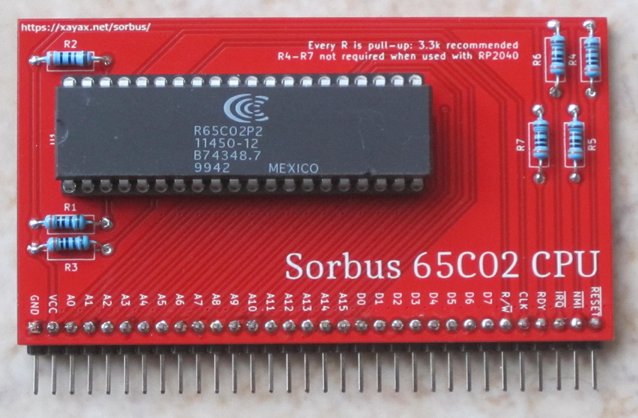

# Sorbus 65C02 CPU

The 65C02 CPU board is just an adapter of the 30 most important pins
of the 65C02 CPU to the Sorbus Backplane bus. Plus a few pull-up
resistors to make sure the CPU doesn't get disturbed by floating
signals.

- [circuit diagram](Sorbus-65C02.pdf)
