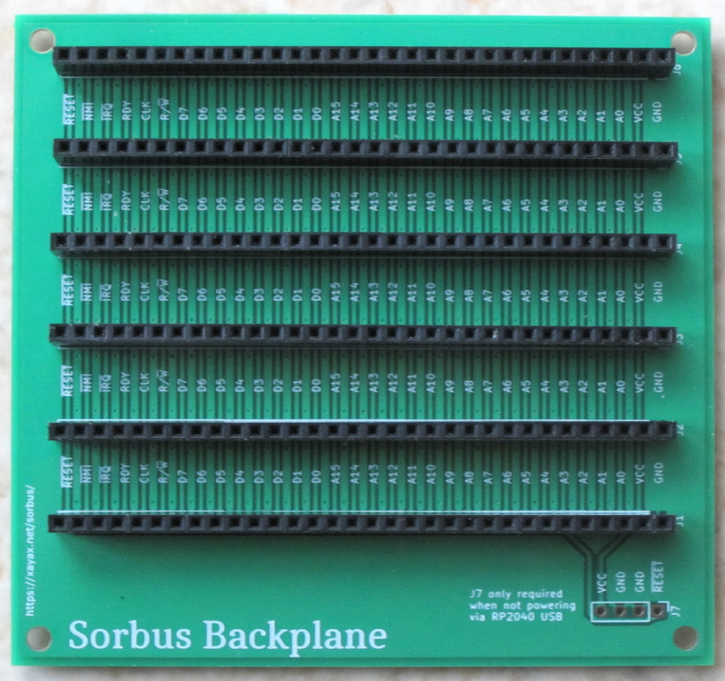

# Sorbus Backplane

The backplane is the board where everything is plugged in. Just
connecting all pin 1 with each other, same with pin 2 and so on.
Nothing much to it.

- [circuit diagram](Sorbus-backplane.pdf)
