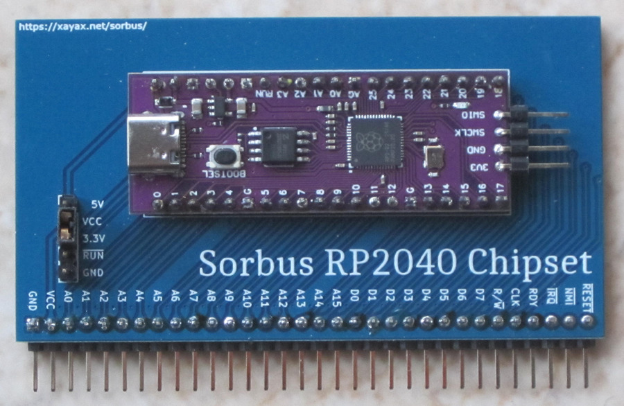

# Sorbus Chipset

The Chipset CPU board is just an adapter for all 30 GPIO of the "RP2040
Purple Board" to be connected to all pins on the bus, so it can drive
the 65C02 on the [65C02 CPU](65c02cpu.md) board.

The Chipset board can also to be hacked to be used as a controller for
a [32x32 WS2812 LED Matrix](../jam/32x32display.md) display. The demo
[1k LEDs Is No Limit](https://xayax.net/1k_leds_is_no_limit/) has been
implemented this way.

- [circuit diagram](Sorbus-Chipset-PurplePico.pdf)
