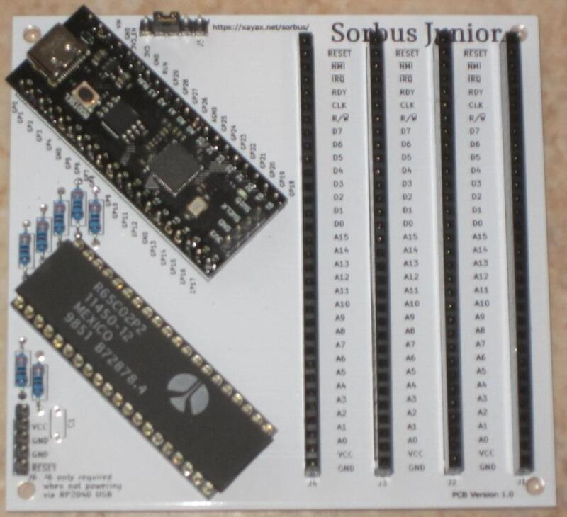

# Sorbus Junior

Sorbus Junior is the boards [backplane](backplane.md),
[65C02 CPU](65c02cpu.md) and [chipset](chipset.md) rolled into one.
The basic idea is to reduce costs and soldering.

(Or late friend [Street Tuff](https://www.pouet.net/prod.php?which=104569)
of [TRSi](https://trsi.org/) requested that. Good idea!)

- [circuit diagram](Sorbus-Junior.pdf)
