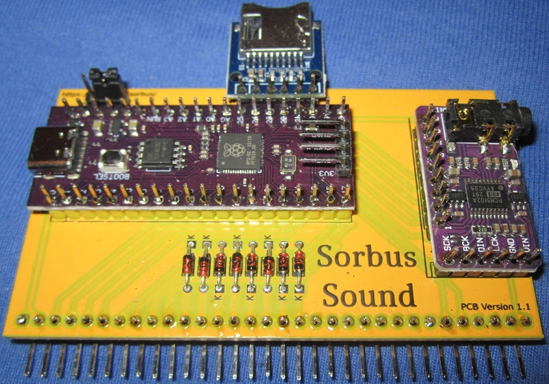

# Sorbus Sound

The Sorbus Sound started out as the idea to build a clone of
[SIDKick pico](https://github.com/frntc/SIDKick-pico) by frenetic
for the Sorbus Computer. However, even though it is capable of doing
more. A [mod](https://en.wikipedia.org/wiki/MOD_%28file_format%29)
player has also been implemented.

The target is to have a sound card which is capable of switching the
emulated sound chip during runtime.

- [circuit diagram](Sorbus-Sound.pdf)
