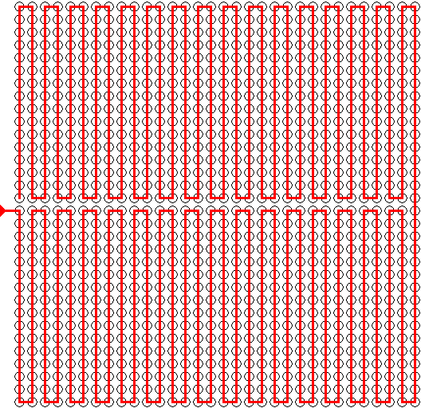
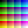
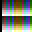
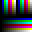

# Sorbus 32x32 LED Display

The panels built so far use this order of LEDs.

## Hardware Setup

The LED hardware is a single string of 1024 WS2812 LEDs created by
concatinating four 16x16 WS2812 panels, which are available on AliExpress
or eBay. The order in the hardcoded translation matrix within the software
looks like this:

Note the first LED is roughly at the middle on the left side. If the order
of the LEDs is different in your setup, you need to create a new translation
matrix. An example on how to create one is available as part of the source
code: `src/tools/translation_matrix.c`.

## I/O Registers

I/O utilizes the page $D3xx. All registers are write only, as the hardware
only sniffes the bus and never actively drives it.

- $D300: DMA into framebuffer and flush (strobe register)
- $D301: DMA into framebuffer without flush (strobe register)
- $D302/3: start address of RAM source
- $D304/5: startpixel of framebuffer target (10 bit, absolute address)
- $D306/7: startpixel of framebuffer X/Y format (5 bit each)
- $D308: width of DMA in pixels-1 (5 bit, $00=one pixel, $1f sets a full line)
- $D309: height of DMA in pixels-1 (5 bit, $00=one line, $1f sets full height)
- $D30A: linestep of source in pixels-1 (8 bit)
- $D30B: transparency color
- $D30C: colormap
- $D30D: custom colormap id register (valid value: 1-3)

- $D310: red color for custom colormap
- $D311: green color for custom colormap
- $D312: blue color for custom colormap

(defaults are starting at $d302: $00,$cc,$00,$00,$00,$00,$1f,$1f,$1f,$00,$00)

If not all bits of a register are required, those will be masked out/ignored.

All addresses have been named nicely in `fb32x32_regs.inc`. For convenience,
you can just `.include 'fb32x32.inc'` which will include everything useful
for writing effects: BIOS call, I/O addresses and `fb32x32_regs.inc`.

## Copy Mode

Value written do $D300/1 indicades mode (can be or'ed together):

- $00: plain copy
- $01: transparency: no copy when source color = transparent
- $02: transparency: no copy when destination color = transparent
- $04: transparency: only copy when destination color = transparent
- $06: do nothing

## Color Palettes

| Color | Description                           | Example                                |
| :---: | :------------------------------------ | :------------------------------------- |
|  $00  | Insane's RGBI2222                     |  |
|  $01  | Custom 1                              |                                        |
|  $02  | Custom 2                              |                                        |
|  $03  | Custom 3                              |                                        |
|  $04  | C64 like                              |  |
|  $05  | C16 like                              |  |
|  $06  | Atari 8-bit like                      |  |
|  $07  | Atari 8-bit like, ordered differently |  |
|  $08  | Veto's custom curated                 |  |
|  $09  | Coder colors (C128 VDC like)          |  |

Note that the example colormaps do not reflect the correct brightness of
the colorvalues. Those are just the same values converted to RGB.

Custom defined color palettes are always specified in RGB444. Writing
to $D30D resets internal index of $D310-$D312 to $00, when a colorvalue
is written, lower 4 bits will be taken as value for this index, and the
index will be incremented. Once $100 color values has been written,
that color slot does not take new color values. Adding $80 to the index
value will fill the palette in reverse order starting with $ff going
down. If a value other than $01-$03 and $81-$83 is written to $D30D,
then $D310-$D312 will not accept any data.

Also selecting the colormap by writing to $D30C copies the palette to the
"current palette", so only then the data is updated not during writing to
$D310-$D312.

Since the board just sniffes the bus, DMA from internal drive or swap
pages is not detected.
