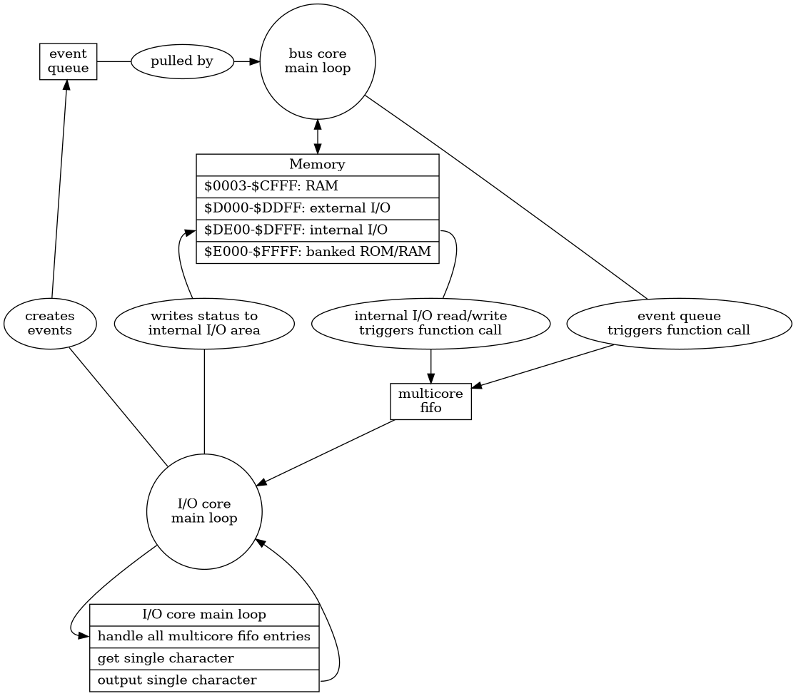

Core Messaging
==============

(TODO before release: clean up here)

The Sorbus Computer with it's JAM core is intended to be an
implementation that a single person can understand with all it's
facettes.

However, the way the two micro controller cores in the RP2040 of the
mainboard communicate with each other has become a little complex. This
is due to a couple of reasons. One is performance: the communication has
to be efficient to provide a 6502 clock speed of more than 1MHz. Another
one is stabiliy of the clock. But to achive these goals, there have been
a couple of changes and rewrites of the code. To allow for an easier
entry into this code, this page was created.

This diagram looks like this:

Now, let's take a look at all the components shown here.

Memory
------

This part is an inside view of the core-to-core communication between the
`bus-core` and `io-core`.

Main source of communication is the memory. The internal I/O area is first
of all treated like normal memory. When it's written to, the data is kept
in the "I/O RAM". But even more, the data read from I/O space is read from
"I/O RAM". This mean that the I/O data needs to be prepared in advance.

Also, when an address is shared in a way that read and write have totally
different functions, then the write handler must ensure that the written
data will be replaced with the one required by the next read.

The Multicore Fifo
------------------

The `bus-core` send messages to the `io-core` on what needs further
attention. The message is packed into an `uint32`. This is unidirectional
and "fire and forget".

The format of the `uint32` is derived from the trace information and
looks like this `0xCCDDAAAA`, where the parts are:

- CC: command, so what to do
- Note: CC is the only significant part, the rest is defined by that
  command, what's noted here is just common practice
- DD: data, the data bus, also just an 8-bit argument
- AAAA: address, the address bus, also just an 16-bit argument

Here's an overview of the command byte:

| Value | Function                         | Note                                                  |
| ----- | -------------------------------- | ----------------------------------------------------- |
| 0x01  | Reset                            | handle reset line as well as reset of internal I/O    |
| 0x02  | Notify about internal I/O write  | parameter are false, uint8 data, and uint16 address   |
| 0x03  | Notify about internal I/O read   | parameter are true and uint16 address                 |
| 0x04  | Meta                             | leave regular execution, stop system, enter meta mode |
| 0x05  | CPU frequency tester             | every 1M clock cycles, the time spent is measured     |
| 0x06  | Timer                            | used by cycle based timers                            |
| 0x07  | Flash                            | flush the dhara flash layer                           |

Others are undefined. Also the range supported internally only is 0x00-0x0F.

The I/O functions (0x02 and 0x03) are handled slightly differently.

### Message 0x02: Notify about internal I/O write

- DD: data bus of 6502
- AAAA: address bus of 6502
- also note that the lowest bit of the command matches the r/!w line
  (this is intended by design)

### Message 0x03: Notify about internal I/O read

- DD: data bus of 6502
- AAAA: address bus of 6502
- also note that the lowest bit of the command matches the r/!w line
  (this is intended by design)

User Input
----------

Things would be so much easier without the user input. However, the
`io-core` besides checking for messages from the multicore fifo also
needs to check for user input via and output by the program do be sent
over the USB UART.

The I/O core does each of these things in a loop: check for a fifo
message, check for user input and check for output. If an action is
required for one of these tasks.

For storing the data for input and output the queues from the Pico SDK
are used. No need to reimplement the wheel.

The Event Queue
---------------

For interrupts and other events that can happen, there is a tick based
event queue inplemented. You can also create an event that will happen
in, for example 20000 cycles, to flush the cache of the wear levelling
flash storage. If another write takes place in between, you can cancel
the previous event and set up a new one.

The way of communication here is that the `io-core` sets up an event,
and then the `bus-core` runs that loop to send the event back to the
`io-core`. The intention here is to have a tight coupling of both cores.

The CPU pins
------------

| Signal | 65C02 | bus-core | io-core |
| ------ | ----- | -------- | ------- |
| A0-A15 |   o   |    i     |         |
| D0-D7  |   x   |    x     |         |
| R/!W   |   o   |    i     |         |
| CLK    |   i   |    o     |         |
| RDY    |   i   |    i     |    o    |
| IRQ    |   i   |          |    o    |
| NMI    |   i   |          |    o    |
| RESET  |   i   |    i     |    x    |

- x: used for input and output
- i: input only
- o: output only

