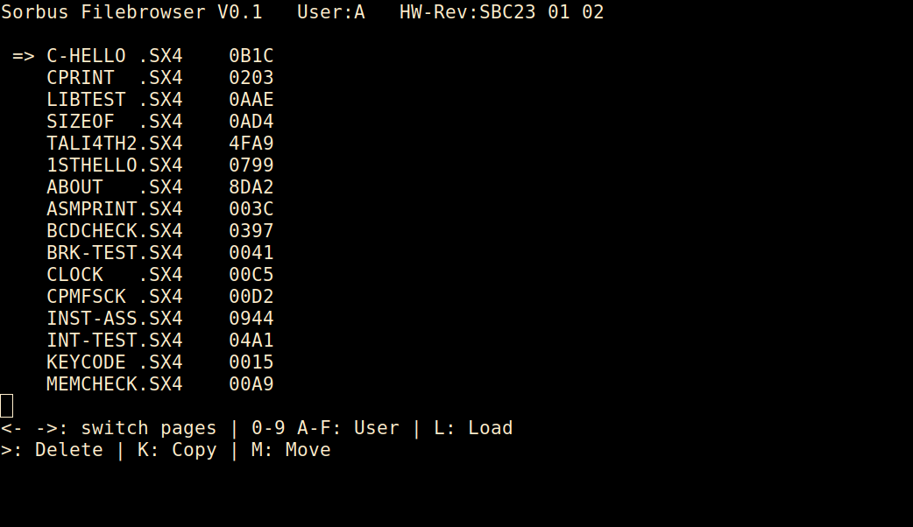

# Filebrowser

Instead of using the command line or [BASIC](ms_basic.md) to load programs
the decision was made to create a filebrowser that allows the basic
functions to be performed.

It provides the basic functionality required to get minimum stuff done
handling files. It is not much more than a rough hack, but works well
enough for simple tasks.

## Keys

| Key                | Function                                   |
| ------------------ | ------------------------------------------ |
| cursor up/down     | move arrow up down                         |
| home / end         | move arrow to first / last displayed item  |
| cursor left/right  | display next/previous "page" of entries    |
| 0-9,A-F            | change the "user"                          |
| L / return         | load a file according to file extension    |
| >                  | delete current file                        |
| K                  | copy a file                                |
| M                  | move / rename a file                       |

## Caveats

File copying and moving (rename) will work by loading the file to memory
and writing it back. This means these functions, as well as loading are
limited to 51k of data ($cc00 bytes). Executeable file formats are
described as [part of main JAM information](index.md#executeable-formats).
