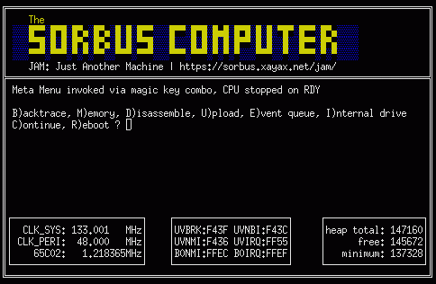
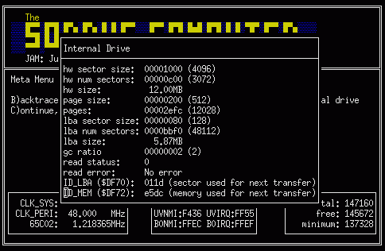
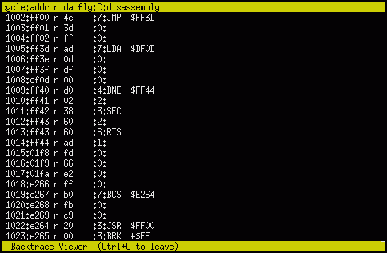
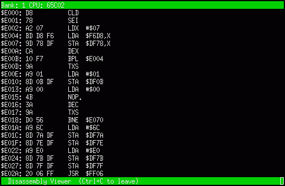
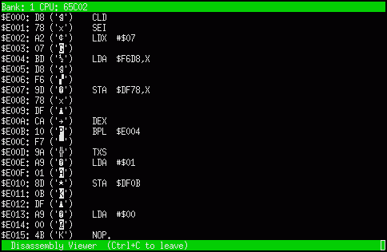
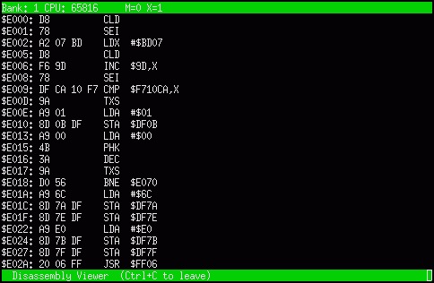
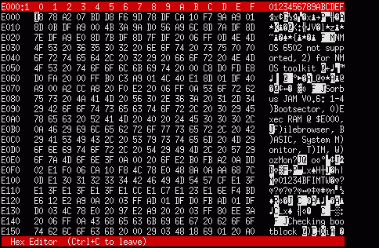
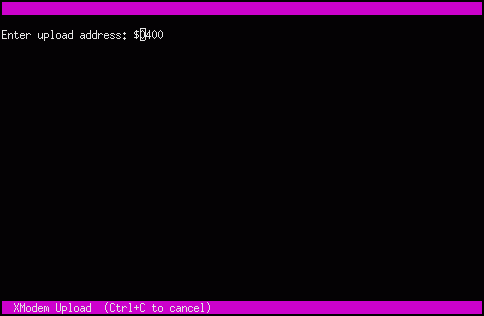

# Meta-Mode

Pressing `Ctrl+]` (or `^`) will get you in a "meta-mode" where the CPU
stops. This mode can also be invoked by writing to address `$DF01` or
programming the watchdog timer. In any case the same meta menu is shown
which provides some information mostly intended for developers. A few
entries there also relate to "monitor commands".

Using terminal escape sequences, the current screen is requested to be
stored and restored when leaving the meta-mode. However, this is relying
on a terminal feature, so if your terminal does not support it, the
output will not be restored.

The bottom boxes show some information about the system:

* left: clock frequencies and also the CPU variant detected
* middle: interrupt vectors, "B0" referencing bank 0, which is RAM
* right: memory usage of the RP2040 code

Some information (mostly intended for system developers) is shown as
pop-ups.

---

## Backtrace

Pressing `B` will show the last 1024 accesses to the bus (aka
CPU cycles). This option will also provide some disassembly. However,
not every line is valid, as an instruction takes several cycles to
execute (up to 8), and the hardware indicating an instruction fetch
(the SYNC pin) could not be utilized. To compensate, a heuristic is
implemented which tries to accomplish the same by analysing the
recorded trace. Still, this is not always 100% accurate.

### Backtrace Columns

| Name        | Function                                                            |
| ----------- | ------------------------------------------------------------------- |
| cycle       | artifical number of cpu cycle (aka "linenumber")                    |
| addr        | address being accessed                                              |
| r           | indicate if access was read (`r`) or write (`w`)                    |
| da          | data byte being read or written                                     |
| flg         | indicate if reset (`R`), IRQ (`I`), NMI (`N`) lines are pulled low  |
| C           | confidence of algorithm, that the current line is an instruction    |
| disassembly | disassmbled address, if algorithm is confident enough               |

### Backtrace Keys

| Key       | Function                                       |
| --------- | ---------------------------------------------- |
| UP        | move cursor one line up                        |
| DOWN      | move cursor one line down                      |
| PAGE UP   | move cursor one page up                        |
| PAGE DOWN | move cursor one page down                      |
| HOME      | go to start backtrace                          |
| END       | go to end backtrace                            |
| S         | disassemble from top screen line to buffer end |
| SHIFT+S   | disassemble single top screen line             |
| Ctrl+L    | redraw everything                              |
| Ctrl+C    | leave disassembler                             |

---

## Disassembler

Pressing `D` will enter the disassembler. This does not show the code
by analysing the last clockcycles executed, but by looking at the memory,
like the disassembler implemented on the 65C02 itself. You can scroll
back and forth through memory. Scrolling back might produce incorrect
output, since the is no 100% bullet proof way to implement this.

Press `Ctrl+C` or `Q` to quit and return to meta menu.

Pressing `V`, the disassembler can be switched into a mode where every
byte is shown on it's own line, also adding an ASCII representation. It's
intended to make things easier deciding if you're looking at code or data.
especially when looking at inline text after `JSR $FF06`.

When switched to 65816, the keys `M` and `X` switch the different word
sizes of accumulator and index registers, like shown below for the index
registers. (It doesn't make sense in the case of the example code,
though...)

### Disassembler Keys

| Key       | Function                                      |
| --------- | --------------------------------------------- |
| UP        | move cursor one line up                       |
| DOWN      | move cursor one line down                     |
| PAGE UP   | move cursor one page up                       |
| PAGE DOWN | move cursor one page down                     |
| M         | switch 65816 "M" flag for disassembly         |
| X         | switch 65816 "X" flag for disassembly         |
| (Ctrl+)P  | switch processor for disassembly              |
| (Ctrl+)B  | switch to next bank                           |
| (Ctrl+)V  | switch view (one byte / instruction per line) |
| (Ctrl+)G  | go to specified address                       |
| Ctrl+L    | redraw everything                             |
| Ctrl+C    | leave disassembler                            |

---

## Memory Editor

Pressing `M` will enter the memory hex editor. You can move around
freely and change anything you like. Keep in mind that the areas
$0000-$0003 and $D000-$DEFF are I/O address space and cannot be
accessed by the 65C02 directly. The area of $DF00-$DFFF are internal
I/O which uses the underlying memory as cache. Changing values there
will not trigger the I/O functionality, but only chang the cache.

### Memory Editor Keys

| Key       | Function                                      |
| --------- | --------------------------------------------- |
| UP        | move cursor one line up                       |
| DOWN      | move cursor one line down                     |
| PAGE UP   | move cursor one page (=256 bytes) up          |
| PAGE DOWN | move cursor one page (=256 bytes) down        |
| LEFT      | move cursor one character / hex value left    |
| RIGHT     | move cursor one character / hex value right   |
| HOME      | go to start of line                           |
| END       | go to end of line                             |
| TAB       | switch between hex and ASCII                  |
| Ctrl+B    | switch to next bank                           |
| Ctrl+G    | go to specified address                       |
| Ctrl+C    | leave memory editor                           |

---

## Upload

Pressing `U` allows to upload a file to memory using the
[XModem](https://en.wikipedia.org/wiki/XMODEM) protocol, after entering
the memory address the contents should be uploaded to.

